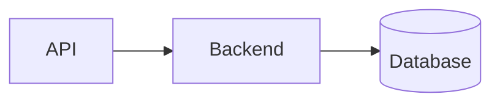
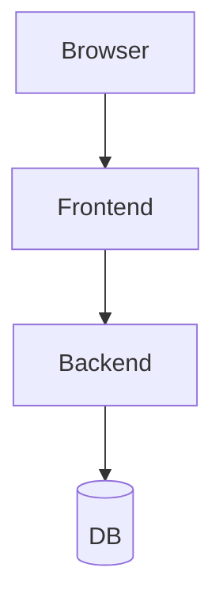
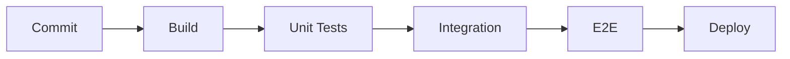
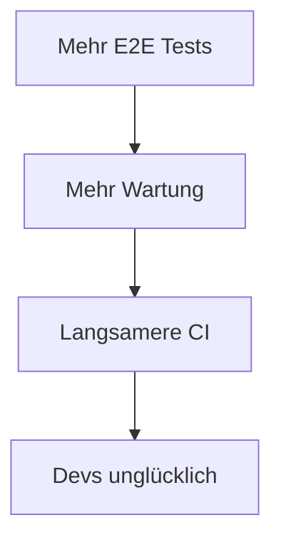

<style>
.slidev-layout table {
  width: 100%;
  border-collapse: collapse;
  font-size: 0.95rem;
}
.slidev-layout th,
.slidev-layout td {
  padding: 0.5rem 0.75rem;
  border-bottom: 1px solid rgba(255, 255, 255, 0.12);
}
.slidev-layout th {
  font-weight: 600;
  text-align: left;
  border-bottom-width: 2px;
}
.card {
  padding: 1rem;
  border-radius: 0.5rem;
  border: 1px solid rgba(255, 255, 255, 0.15);
  background: rgba(255, 255, 255, 0.06);
}
.card h2 {
  margin-top: 0;
  font-size: 1.1rem;
}
.card p,
.card ul {
  margin-bottom: 0;
  opacity: 0.9;
}
.pros {
  padding: 1rem 1.25rem;
  border-radius: 0.5rem;
  border-left: 4px solid #22c55e;
  background: rgba(34, 197, 94, 0.1);
}
.cons {
  padding: 1rem 1.25rem;
  border-radius: 0.5rem;
  border-left: 4px solid #ef4444;
  background: rgba(239, 68, 68, 0.1);
}
.callout-bad {
  color: #fca5a5;
  font-weight: 500;
}
.callout-good {
  color: #86efac;
  font-weight: 500;
}
.backup-slide {
  opacity: 0.9;
}
.backup-slide h1 {
  font-size: 1.75rem;
}
.slidev-layout h1 {
  margin-bottom: 5rem; /* try 1.25rem–2.5rem */
}
</style>

# Testautomatisierung für Entwickler

## Von Unit Tests bis End2End

---
layout: section
---

# Agenda

<div class="grid grid-cols-2 gap-x-12 gap-y-2 mt-8 text-left max-w-2xl mx-auto text-lg">

<div>

- Motivation
- Grundlagen von Softwaretests
- Teststrategien
- Testautomatisierung

</div>

<div>

- CI/CD Integration
- Praxis
- Best Practices

</div>

</div>

---

# Warum testen wir überhaupt?

<v-clicks class: mt-8>

- Fehlervermeidung
  - Fehler frühzeitig erkennen
  - Produktionsfehler reduzieren
- Wartbarkeit
  - Gut testbarer Code -> gut wartbarer Code
  - Refactorings absichern
- Schnellere Entwicklung
  - neue Features
  - Bugfixing
- Seelenfrieden für Releases

</v-clicks>

---

# Was wenn man nicht testet

<v-clicks class: mt-8>

- Wiederkehrende Bugs
- Fehler werden gefunden (aber in Prod)
- Hohe Kosten für späte Behebung
- Stress für Entwickler*innen

</v-clicks>

---

# Warum automatisiert testen?

<div class: mt-8>
<v-clicks>

* Wiederholbar
* Schnell
* Skalierbar
* CI/CD kompatibel
* Schnellere Feedbackzyklen
* Sicherheit bei Refactoring
* Manuelle Tests sind mühsam

</v-clicks>
</div>

---
layout: center
class: text-center
---

# Diskussion

## Was sind eure Erfahrungen?

<div class="mt-12 text-left text-xl max-w-xl mx-auto space-y-2">

* Wie enthusiastisch schreibt ihr Tests?
* Gibt es ein Test/QA-Team?
* CI/CD Integration?
* Niedrigste Test Coverage?

</div>


---
layout: section
---

# Grundlagen von Softwaretests

---

# Arten von Tests

<div class="grid grid-cols-3 gap-4 mt-8">

<div class="card">

## Unit

Kleine isolierte Komponenten

</div>

<div class="card">

## Integration

Zusammenspiel mehrerer Komponenten

</div>

<div class="card">

## End2End

System, UI bis Datenbank

</div>

<div class="card">

## Performance

Last & Skalierung

</div>

<div class="card">

## Security

Sicherheitsschwachstellen und PEN-Tests

</div>

<div class="card">

## Design & Usability

Benutzerfreundlichkeit, Barrierefreihet

</div>

</div>

---

# Unit Tests


<div class: mt-8>

* Schnell
* Isoliert
* einzelne Komponenten
* Viele Testfälle
* Hohe Testabdeckung

</div>

<div class: mt-8>

```java
@Test
    void signin_throwsWhenUserNotFound() {
        when(userRepository.findByUsername("testuser")).thenReturn(Optional.empty());

        assertThatThrownBy(() -> authService.signin(validRequest))
                .isInstanceOf(InvalidCredentialsException.class);
    }
```

</div>

---

# Integrationstests

<div class="grid grid-cols-2 gap-8 items-center mt-8">

<div>

* Interaktionen zwischen Komponenten
* Datenbank
* APIs
* Services
* Messaging

</div>

<div>



</div>

</div>

---

# End2End Tests

<div class="grid grid-cols-2 gap-8 mt-8">

<div>

* Browser
* Frontend
* Backend
* Datenbank

</div>

<div>



</div>

</div>

---

# Performance/Last Test

<div class: mt-8>

- Testet Geschwindigkeit, Stabilität und Responsiveness
- Funktioniert das System mit erwarteter Last?
- Indentifiziert Performance Bottlenecks
- Benötigt produktionsnahe Testumgebung
</div>

---

# Security/Pen-Test

<div class: mt-8>

- Vulnerability/Security Scanning
- Simulation von Angriffen
- Evaluation durch Spezialisten
</div>

---

# Usabiltiy Test

<div class: mt-8>

- Einhaltung von Designvorgaben
- Barrierefreiheit
- Nutzerfreundlichkeit
- Tests mit Usern bzw. mit Spezialisten
</div>

---

# Vergleich der Testarten

<div class: mt-8>


| Typ         | Schnell   | Stabil    | Realistisch |
| ----------- | --------- | --------- | ----------- |
| Unit        | Sehr hoch | Sehr hoch | Niedrig     |
| Integration | Mittel    | Mittel    | Mittel      |
| E2E         | Niedrig   | Mittel    | Sehr hoch   |

</div>

---
layout: section
---

# Das Testprojekt

---

Setup

```bash
git clone 
cd example
docker-compose up
```

---
layout: section
---

# CI/CD Integration

---

# Pull Request Validation

<div class: mt-8>

- Automatische Tests für jeden Pull Request
- Merge nicht möglich wenn Pipeline failt
- Qualitätsstandard sichergestellt
- Stabilere Entwicklungsumgebung

</div>

---

# Tests in der Pipeline

<div class="flex flex-col justify-center flex-1 min-h-[50vh]">


</div>

---

# Tools

<div class: mt-8>

- github Actions
- gitlab CI
- Jenkins

</div>

---

# Beispiel CI 

```yml
name: Java CI with Maven

on:
  push:
    branches: [ "main" ]
  pull_request:
    branches: [ "main" ]

jobs:
  build:

    runs-on: ubuntu-latest

    steps:
    - uses: actions/checkout@v4
    - name: Set up JDK 21
      uses: actions/setup-java@v4
      with:
        java-version: '21'
        distribution: 'temurin'
        cache: maven
    - name: Build with Maven
      run: mvn -B package --file pom.xml
      working-directory: example/backend
```

---
layout: section
---

# Teststrategien

---

# Die Testpyramide

<div class="flex flex-col items-center gap-2 mt-12 w-full max-w-md mx-auto">

<div class="w-1/3 py-2 text-center rounded bg-blue-500/25 text-sm font-medium">E2E</div>
<div class="w-2/3 py-2 text-center rounded bg-blue-500/35">Integration / API</div>
<div class="w-full py-3 text-center rounded bg-blue-500/45 font-semibold">Unit Tests</div>

</div>

<div class="mt-12">

<v-clicks>

* Viele Unit Tests
* Weniger Integrationstests
* Wenige E2E Tests

</v-clicks>

</div>

---

# Zu viele E2E Tests

<div class="grid grid-cols-2 gap-8 items-center">

<div>

* Langsame Pipelines
* Hoher Wartungsaufwand
* Fragile Tests
* Lange Feedbackzeiten

</div>

<div>



</div>

</div>

---

# Welche Szenarien automatisieren?

<div class="grid grid-cols-2 gap-8 mt-12">

<div class="pros">

## Gute Kandidaten

* Kritische Business Flows
* Regressionen
* Wiederkehrende Tests
* Selbes Szenario mit unterschiedlichen Daten
* APIs

</div>

<div class="cons">

## Schlechte Kandidaten

* Instabile Features
* Einmalige Tests
* Stark wechselnde UI

</div>

</div>

---

# Risiko-basierte Teststrategie

<div class: mt-12>

| **Risiko**  | **Nutzung** | **Priorität**      |
| ------- | ------- | -------------- |
| Hoch    | Hoch    | Automatisieren |
| Hoch    | Niedrig | Optional       |
| Niedrig | Hoch    | Teilweise      |
| Niedrig | Niedrig | Manuell        |

</div>

---

# Wann lohnt sich Automatisierung?

<div class: mt-12>

### Häufigkeit × Aufwand × Risiko

</div>

<div class="mt-5 text-lg">

<v-clicks>

* Wie oft wird getestet?
* Wie teuer ist manuelles Testen?
* Wie kritisch ist der Fehler?

</v-clicks>

</div>

---
layout: section
---

# E2E Tests

---
layout: quote
--- 

# E2E Tests

End-to-End Tests simulieren das Verhalten echter Nutzer, um kritische Workflows über alle Systemebenen (Frontend, Backend, Datenbanken und APIs) zu validieren.

---

# Vorteile

<div class: mt-8>

- Realitätsnahe & Systemübergreifend
- Nutzerorierntiert, "echte" Workflows
- Decken Bugs in eg. Navigation, Systemzusammenspiel auf
- Web-Apps mit echten Browsern testen

</div>

---

# Nachteile

<div class: mt-8>

- Langsam und instabil
- False Negatives
- Oft anzupassen
- Testdatenmanagement

</div>

---

# Frameworks

<div class: mt-8>

- Selenium
- Cypress
- Playwright
- Tosca (honorary mention)

</div>

---

# Selenium

<div class: mt-8>

- ursprünglich 2004 entwickelt
- Kommunikation mit Browser über WebDriver
- unterstützt diverse Sprachen
- durch Langlebigkeit Standard in vielen Projekten

</div>

---

```javascript
const {By, Builder, Browser} = require('selenium-webdriver');
const assert = require("assert");

(async function firstTest() {
  let driver;
  
  try {
    driver = await new Builder().forBrowser(Browser.CHROME).build();
    await driver.get('https://www.selenium.dev/selenium/web/web-form.html');
  
    let title = await driver.getTitle();
    assert.equal("Web form", title);
  
    await driver.manage().setTimeouts({implicit: 500});
  
    let submitButton = await driver.findElement(By.css('button'));
    await submitButton.click();
  
    let message = await driver.findElement(By.id('message'));
    let value = await message.getText();
    assert.equal("Received!", value);
  } catch (e) {
    console.log(e)
  } finally {
    await driver.quit();
  }
}())
```

---

# Cypress

<div class: mt-8>

- In-Browser Execution
- Leichteres Setup
- JS/Typescript
- Für Webapplikationen

</div>

---

<div class: mt-8>

```javascript
describe('My First Test', () => {
  it('Gets, types and asserts', () => {
    cy.visit('https://example.cypress.io')

    // find element with content: type
    cy.contains('type').click()

    // Should be on a new URL which
    // includes '/commands/actions'
    cy.url().should('include', '/commands/actions')

    // Get an input, type into it
    cy.get('.action-email').type('fake@email.com')

    //  Verify that the value has been updated
    cy.get('.action-email').should('have.value', 'fake@email.com')
  })
})
```

</div>

---

# Playwright

<div class: mt-8>

- Kommunikation über native Browser Debugging-Protokolle
- Gute Developer Experience
- Typescript, Python, .Net, Java
- Für Webapplikationen

</div>

---

<div class: mt-12>

```javascript
import { test, expect } from '@playwright/test';

test('get started link', async ({ page }) => {
  await page.goto('https://playwright.dev/');

  // Expect a title "to contain" a substring.
  await expect(page).toHaveTitle(/Playwright/);

  // Click the get started link.
  await page.getByRole('link', { name: 'Get started' }).click();

  // Expects page to have a heading with the name of Installation.
  await expect(page.getByRole('heading', { name: 'Installation' })).toBeVisible();
});
```

</div>

---

# Selenium vs Cypress vs Playwright

| **Thema**                    | **Selenium**                             | **Cypress**                                         | **Playwright**                |
| ------------------------ | ------------------------------------ | ----------------------------------------------- | ------------------------- |
| Erscheinungsjahr         | ältestes Framework                   | moderner                                        | sehr modern               |
| Sprache                  | viele (Java, Python, C#, JS, Ruby …) | JavaScript / TypeScript                         | JS/TS, Python, Java, .NET |
| Geschwindigkeit          | eher langsamer                       | schnell                                         | sehr schnell              |
| Multi-Tab/Window | möglich                              | eingeschränkt                                   | sehr gut                  |
| Architektur              | WebDriver-Protokoll                  | läuft im Browser                                | direkte Browsersteuerung  |
| Lernkurve                | mittel bis hoch                      | einfach                                         | mittel                    |
| CI/CD-Eignung            | gut                                  | sehr gut                                        | sehr gut                  |

---

# Run Playwright Tests

<div class: mt-8/>

#### setup

```shell
cd e2e
npm install
```

<div class: mt-8/>

#### run tests
```shell
npx playwright test
```

---

<div class: mt-12/>

```js
test('signup successfully', async ({ page }) => {
  await page.goto('http://localhost:3000/');
  
  await page.getByTestId('username-input').fill('testuser');
  await page.getByTestId('password-input').fill('password123');
  await page.getByText('Sign up').click();

  await expect(page.getByTestId('welcome-message')).toContainText('Welcome, '+username+'!');
});
```

---

# Run Playwright Tests

<div class: mt-8/>


#### run tests with UI
```shell
npx playwright test signup.spec.ts --ui
```

---

<div class: mt-12/>

```js
test('signup successfully', async ({ page }) => {
  await page.goto('http://localhost:3000/');
  const username = 'testuser'+Date.now();
  
  await page.getByTestId('username-input').fill(username);
  await page.getByTestId('password-input').fill('password123');
  await page.getByText('Sign up').click();

  await expect(page.getByTestId('welcome-message')).toContainText('Welcome, '+username+'!');
});
```

---

# Testdatenmanagement

<div class: mt-8/>

- Wiederholbarkeit sicherstellen
- Testdaten in Fixtures oder JSON-Dateien auslagern
- Für jeden Testlauf frische Daten per API generieren
- Nach dem Test aufräumen (Teardown). Kein Test darf den Zustand für den nächsten beeinflussen.
- Prod-Daten nie in Tests verwenden (DSGVO!)

---

# Schlechte Selektoren

<div class="grid grid-cols-3 gap-4 mt-8 text-sm">

```css
div:nth-child(2)
```

```css
.button.primary
```

```css
#generated-id-48392
```

</div>

<p class="mt-12 callout-bad text-lg">

Fragil und schwer wartbar

</p>

---

# Fallbeispiel

<div class: mt-8/>

```bash
git checkout selektoren
docker-compose up frontend --build
```

<div class: mt-8/>

```ts
test('signup successfully', async ({ page }) => {
  await page.goto('http://localhost:3000/');
  const username = 'testuser'+Date.now();
  
  await page.getByTestId('username-input').fill(username);
  await page.getByTestId('password-input').fill('password123');
  await page.getByText('Sign up').click();

  await expect(page.getByTestId('welcome-message')).toContainText('Welcome, '+username+'!');
});
```

---

# Gute Selektoren

<div class="grid grid-cols-2 gap-8 mt-8">

```html
<button data-testid="signup-button">
```

```ts
page.getByTestId('signup-button')
```

</div>

<p class="mt-8 callout-good text-lg">

Stabil und wartbar

</p>

---

# Anpassung bei Änderungen

<div class: mt-8/>

- Code wartbar halten (Page Object Model)
- Consumer-Driven Contract Testing (Pact) für Schnittstellen
- Testdaten und Config versionieren

---

# Page Object Pattern

<div class: mt-8/>

```ts
// Page Object: Änderung nur an einer Stelle
class LoginPage {
  private readonly page: Page;
  readonly usernameInput = () => this.page.getByLabel('Benutzername');
  readonly passwordInput = () => this.page.getByLabel('Passwort');
  readonly submitButton = () => this.page.getByRole('button', { name: 'Anmelden' });

  async login(user: string, pass: string) {
    await this.usernameInput().fill(user);
    await this.passwordInput().fill(pass);
    await this.submitButton().click();
  }
}
```

---

# Coding Conventions

<div class: mt-8/>

<v-clicks>

* Linting
* Namensgebung einheitlich
* Keine Magic Waits
* Test Isolation
* Ordnerstruktur
* Code-Review

</v-clicks>

---

# Typische Probleme aus der Praxis

<div class: mt-8/>

<v-clicks>

* Instabile Testumgebungen
* Langsame Tests
* Schlechte Testdaten
* Wartungskosten
* Fehlende Ownership

</v-clicks>

---

# Best Practices

<div class: mt-8/>

<v-clicks>

* Viele kleine Tests
* Stabile Selektoren
* Möglichst wenig E2E
* Tests Teil der Entwicklung
* Früh automatisieren*

</v-clicks>

---

# Wann E2E testen?

<div class: mt-8/>

- Wichtigste Workflows in CI 
  - äußerst sparsam wegen Durchlaufzeit!
- Smoketests nach Releases
- Scheduled E2E Tests (z.B. nachts)

---
layout: statement
---

# Fazit

## Testautomatisierung ist Software Engineering

<div class="mt-8 text-lg">

<v-clicks>

Gute Tests beschleunigen Entwicklung <br>
Qualität entsteht im Entwicklungsprozess <br>
CI/CD und Automatisierung für Verlässlichkeit

</v-clicks>

</div>

---
layout: center
class: text-center
---

# Fragen?

## Diskussion & Erfahrungsaustausch
